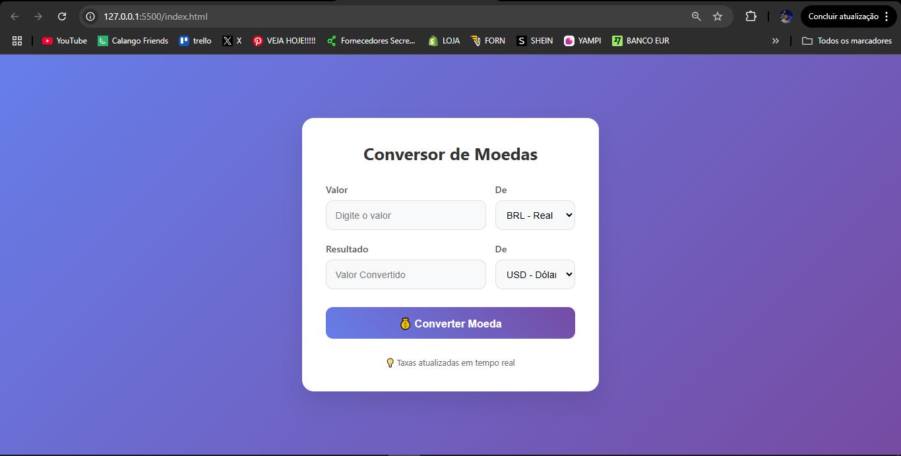

# 💱 Conversor de Moedas

Um conversor de moedas simples e direto, desenvolvido com HTML, CSS e JavaScript. Permite ao usuário selecionar duas moedas diferentes e converter valores entre elas em tempo real, utilizando dados da API de câmbio.

## 🚀 Funcionalidades

- Seleção de moeda de origem e destino
- Conversão em tempo real
- Interface simples e responsiva
- Atualização automática da taxa de câmbio

## 🖥️ Tecnologias utilizadas

- HTML5  
- CSS3  
- JavaScript  
- [ExchangeRate-API](https://www.exchangerate-api.com/)

## 📷 Prévia

 <!-- Substitua pelo nome real da imagem se houver -->

## 🛠️ Como usar

1. Clone o repositório:
   ```bash
   git clone https://github.com/GabrielAlderige/conversor-moedas.git
   ```

2. Acesse a pasta do projeto:
   ```bash
   cd conversor-moedas
   ```

3. Abra o `index.html` no navegador:
   - Clique duas vezes no arquivo `index.html`  
   - Ou use uma extensão como o Live Server no VSCode

## 📌 Observações

- Certifique-se de que a API de câmbio utilizada esteja funcionando corretamente e que sua chave (se necessária) esteja configurada.

## 📄 Licença

Este projeto está sob a licença MIT. Veja o arquivo [LICENSE](LICENSE) para mais detalhes.

---

Feito por [Gabriel Alderige](https://github.com/GabrielAlderige)
📷 Instagram: [@gabrielalderige](https://instagram.com/gabrielalderige)  
💬 WhatsApp: [Clique aqui para conversar](https://wa.me/5535998416972)
